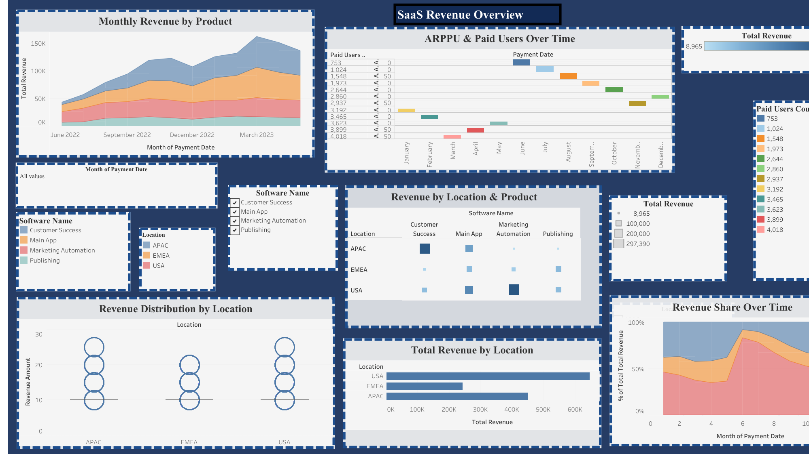

# SaaS Revenue Dashboard (Tableau)

## Project Overview

This project presents an interactive Tableau dashboard designed to analyze SaaS business performance across revenue, user metrics, and regional distribution.

The dashboard provides a comprehensive view of key SaaS KPIs such as ARPPU, paid users, and revenue trends, enabling data-driven decision-making for product and growth teams.

---

## Business Context

SaaS companies rely heavily on recurring revenue and user engagement. Understanding how revenue evolves over time, which products drive growth, and how different regions contribute is essential for optimizing business strategy.

This dashboard focuses on answering key questions such as:

* How is revenue evolving over time?
* Which products contribute the most to total revenue?
* How do regions differ in performance?
* What is the relationship between ARPPU and user growth?

---

## Key Metrics

* **Total Revenue** — overall revenue generated
* **Paid Users** — number of paying customers
* **ARPPU (Average Revenue Per Paying User)**
* **Revenue by Product**
* **Revenue by Region**

---

## Dashboard Components

### 1. Monthly Revenue by Product

Displays how revenue evolves over time across different product categories.
Helps identify seasonal trends and product-driven growth patterns.

### 2. ARPPU & Paid Users Trend

Shows the relationship between user growth and monetization efficiency.
Allows comparison between increases in users and revenue per user.

### 3. Revenue by Region & Product

Breaks down revenue contribution by location and product.
Helps identify regional strengths and product-market fit.

### 4. Revenue Distribution by Region

Visualizes how revenue is distributed across different geographical regions.
Highlights dominant markets and underperforming areas.

### 5. Total Revenue by Region

Compares overall revenue contribution between regions.
Useful for strategic market prioritization.

### 6. Revenue Share Over Time

Tracks how each region contributes to total revenue over time.
Reveals shifts in market dynamics and growth opportunities.

---

## Dashboard Overview

---

## Tools Used

* Tableau
* Data Visualization Techniques
* Business Intelligence Concepts

---

## Key Insights

### Revenue Trends

* Revenue shows a clear peak followed by a significant drop and gradual recovery, indicating possible seasonality or external market impact
* Growth is not linear, suggesting fluctuations in demand or campaign performance

### Product Performance

* Core products such as **Main App** contribute the largest share of revenue
* Secondary products provide support but are not primary revenue drivers
* Revenue concentration indicates potential dependency on a limited number of products

### User & Monetization Behavior

* ARPPU and paid users do not always increase together
* Growth in user base does not necessarily translate into proportional revenue growth
* Indicates potential pricing or user segmentation opportunities

### Regional Insights

* Certain regions consistently outperform others in total revenue
* Revenue distribution varies significantly across locations, suggesting differences in market maturity
* Some regions show stronger performance in specific products, indicating localized product-market fit

### Strategic Implications

* Revenue dependency on key products suggests risk concentration
* Regions with lower performance may require targeted marketing strategies
* Opportunities exist to optimize conversion and monetization rather than only increasing user volume

---

## Live Dashboard
[View Dashboard](https://public.tableau.com/app/profile/g.n.aydo.an/viz/GnAydogan-TableauHomework2-SaaSRevenueAnalysis/Dashboard1)

---

## Conclusion

This dashboard demonstrates how SaaS performance can be analyzed through a combination of revenue metrics, user behavior, and regional insights.

By integrating multiple dimensions of analysis, it provides a structured approach to understanding business performance and identifying growth opportunities.
